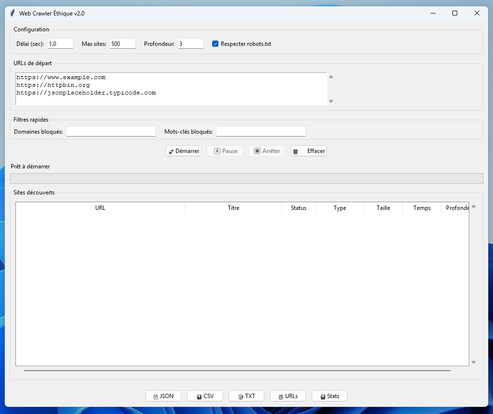

# 🕷️ Ethical Web Crawler v2.0

A GUI-based ethical web crawler that respects robots.txt rules and offers customizable crawling.

  
*Example interface*

## ✨ Features

- **Rules Compliance**: Automatic robots.txt checking
- **Flexible Configuration**:
  - Adjustable request delay
  - Customizable crawling depth
  - Maximum sites limit
- **Smart Filtering**:
  - Domain and keyword blocking
  - Automatic content type detection (HTML, JSON, PDF, etc.)
- **Intuitive Interface**:
  - Real-time results visualization
  - Progress bar and statistics
- **Multiple Export Formats**: JSON, CSV, TXT or URL copy
- **Optimizations**:
  - Asynchronous request handling
  - Bandwidth throttling
  - robots.txt caching

## 🛠️ Installation

1. **Requirements**:
   - Python 3.8+
   - Libraries: `tkinter`, `requests`, `urllib3`

2. **Installation**:
   ```bash
   git clone https://github.com/Clementabcd/ethical-web-crawler.git
   cd ethical-web-crawler
   pip install -r requirements.txt
   ```

3. **Launch**:
   ```bash
   python ethical_web_crawler.py
   ```

## 🚀 Usage

1. Enter starting URLs
2. Configure settings (delay, depth, etc.)
3. Add filters if needed
4. Click "Start"
5. Export results when crawling completes

## 📊 Advanced Features

- **Context Menu**: Right-click on results to:
  - Open in browser
  - Copy URL
  - Remove entry
- **Statistics**: Crawled data visualization
- **Memory Management**: Result limit controls

## 🤖 Ethical Behavior

This crawler is designed to:
- Respect robots.txt by default
- Use configurable request delays
- Clearly identify its user-agent
- Avoid crawling filtered content

## 📜 License

MIT License - see [LICENSE](LICENSE)

---

*Built with Python and ❤️ - Contribute by opening issues or pull requests!*
